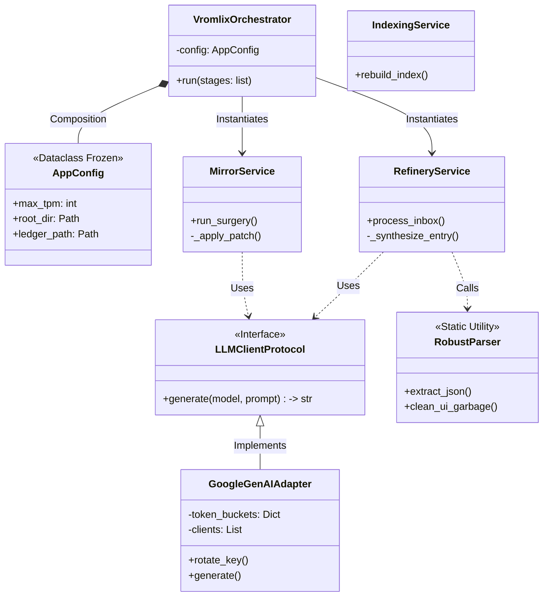

# VROMLIX Architecture: The Da Vinci Protocol

> *"Details make perfection, and perfection is not a detail."*

This document outlines the structural logic of the VROMLIX v8.0 engine, designed as a Modular Monolith with strictly separated concerns (Ingestion, Surgery, Indexing).

## 1. The Data Reactor (System Flow)

This diagram illustrates the transformation of unstructured entropy (Raw Text) into structured crystal (Knowledge Graph). Note the **Split-Brain Topology** ensuring the LLM never overwrites the Kernel Identity.

```mermaid
graph TD
    %% -- STYLING DEFINITIONS --
    classDef entropy fill:#e1f5fe,stroke:#01579b,stroke-width:2px;
    classDef core fill:#fff3e0,stroke:#e65100,stroke-width:2px;
    classDef storage fill:#333,stroke:#fff,stroke-width:2px,color:#fff;
    classDef ai fill:#f3e5f5,stroke:#4a148c,stroke-width:2px,stroke-dasharray: 5 5;

    subgraph INPUT_TRAY ["LAYER 1: ENTROPY (Input)"]
        RawDocs(Raw .txt Files) -->|Stream Read| Ingestor[Ingestion Service]
        Ingestor -->|MD5 Hash| Dedup{Duplicate?}
        Dedup -- Yes --> Trash[Discard]
    end

    subgraph REFINERY ["LAYER 2: THE REFINERY (Analysis)"]
        Dedup -- No --> Swarm((Agent Swarm))
        style Swarm class ai
        Swarm -.->|Gemma-27b| Cronos[Time Extraction]
        Swarm -.->|Gemma-27b| Logos[Mental Models]
        Swarm -.->|Gemma-27b| Techne[Tool Stack]
        
        Cronos & Logos & Techne --> Payload[Structured DTO]
    end

    subgraph MEMORY ["LAYER 3: PERSISTENCE (The Ledger)"]
        Payload -->|Append| JSONL[(Deep Memory .jsonl)]
        style JSONL class storage
    end

    subgraph OPTIMIZATION ["LAYER 4: SYNTHESIS & INDEXING"]
        JSONL -->|Read Context| Mirror[Mirror Service]
        JSONL -->|Extract Text| Vector[Indexing Service]
        
        %% SPLIT BRAIN LOGIC
        Mirror -.->|Gemini-Flash| Surgeon((Profile Surgeon))
        style Surgeon class ai
        Surgeon -->|Patch| XML[(Dynamic Profile .xml)]
        style XML class storage
        
        %% VECTOR LOGIC
        Vector -->|Embedding| MiniLM[[Sentence-Transformers]]
        MiniLM -->|Vectorize| FAISS[(FAISS Index)]
        FAISS -->|Link| CSV[(Master Map .csv)]
        style FAISS class storage
        style CSV class storage
    end

    class RawDocs entropy;
    class Ingestor,Payload,Mirror,Vector core;

```

## 2. Class Hierarchy (Modular Monolith)

VROMLIX v8.0 abandons procedural scripting for a robust Object-Oriented design using Protocols for dependency injection.



## 3. Evolutionary Metrics (v7.5 vs v8.0)

Technical audit justifying the migration to the current architecture.

| Feature | Legacy (v7.5) | VROMLIX GENESIS (v8.0) | Verdict |
| --- | --- | --- | --- |
| **Path Safety** | String concatenation (`os.path.join`) | `pathlib.Path` with resolution checks | **Zero OS Errors** |
| **Config** | Mutable Global Dict | `Frozen Dataclass` + Env Var overrides | **Thread Safe** |
| **Security** | `eval()` (High Risk) | `ast.literal_eval` + `RobustParser` | **Industrial Grade** |
| **Typing** | Partial hints | Modern `list[]`, `dict[]`, `Self`, `override` | **PEP 8 Compliant** |
| **Scalability** | Procedural script | Object-Oriented Services (Testable) | **Maintainable** |

---

*Generated by NEXUS for VROMLIX Engine Documentation.*
